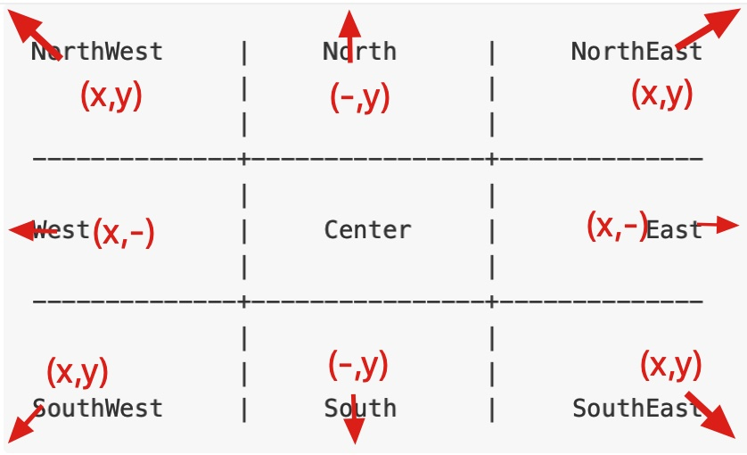

## 生成资源url

根据据资源id生成可访问的url，目前支持
* 图片素材
* 视频素材
* 影集

### 图片素材

[接口文档](http://xyapi.xiaoniangao.cn/project/300/interface/api/7681)

#### 参数说明:

可一次传递多个资源id，一个资源可以处理不同的尺寸
```json
[
    {
        "id": "3739799",
        "qs": [
            "imageMogr2/gravity/center/rotate/180/thumbnail/!165x165r/crop/165x165/interlace/1/format/jpg",
            "imageMogr2/", // 原图不做处理
            "imageMogr2/thumbnail/!200x200r/interlace/1/format/jpg"
        ],
        "watermark": [
              {
                "key": "文字",
                "watermark_qs": "watermark/dx/20/dy/20", // 水印参数
                "ty": 2 
              },
              {
                "key": "49441",
                "ty": 1,
                "qs": "imageMogr2/gravity/center/rotate/$/thumbnail/!200x200r/crop/200x200/interlace/1/format/jpg",
                "watermark_qs": "watermark/gravity/North/dx/70/dy/20/dissolve/10"
              }
        ] // 增加水印
    }
]
```

##### qs参数说明

对于图片来说，涉及到图片的格式转换、大小裁剪、旋转、质量转换等操作，通过对oss封装，完全可以通过qs参数来操作。
```
imageMogr2/auto-orient
          /thumbnail/<imageSizeGeometry>
          /gravity/<gravityType>
          /crop/<imageSizeAndOffsetGeometry>
          /rotate/<rotateDegree>
          /quality/<quality>
          /format/<destinationImageFormat>
          /interlace/<Interlace>
          /circle/<circle>
```

| 参数名称 | 说明 |
| :-----| :----|
| auto-orient | 是否根据原图EXIF信息自动旋正 |
| thumbnail | 参看[缩放操作参数表](#thumbnail)，默认为不缩放。 |
| gravity | 参看[裁剪操作位置](#gravity)，默认为不裁剪。 |
| crop | 参看[裁剪操作参数表](#crop)，默认为不裁剪。 |
| rotate | 旋转角度，取值范围为1-360，默认为不旋转。 | 
| quality | 新图的图片质量。取值范围为1-100。决定图片的相对质量，对原图按照q%进行质量压缩。例如，如果原图质量为100%，添加quality,q_90参数会得到质量为90％的图片。如果原图质量为80%，添加quality,q_90参数会得到质量72%的图片。 |
| format | 图片格式。支持jpg、gif、bmp、png、webp、tiff等，默认为原图格式 |
| interlace | 是否支持渐进显示。取值1支持渐进显示，取值0不支持渐进显示（默认为0）。适用jpg目标格式，网速慢时，图片显示由模糊到清晰。 |
| circle | 指定裁剪图片所用的圆形区域的半径,不能超过原图的最小边的一半。如果超过，则仍按照图片最大内切圆进行裁剪。如果图片的最终格式是PNG、WebP或BMP等支持透明通道的图片，那么图片非圆形区域的部分将会以透明填充。如果图片的最终格式是JPG，那么非圆形区域是以白色进行填充。推荐保存成PNG格式。 |

<a name="thumbnail">缩放操作参数表</a>

| 参数名称 | 说明 |
| :-----| :----|
| /thumbnail/!\<Scale\>p | 基于原图的长宽，按指定百分比缩放。小于100为缩小，大于100为放大。Scale取值范围1-999。 |
| /thumbnail/\<Width\>x | 指定目标图片宽度，高度等比缩放，Width取值范围1-4096。 |
| /thumbnail/x\<Height\> | 指定目标图片高度，宽度等比缩放，Height取值范围1-4096。 |
| /thumbnail/\<Width\>x\<Height\> | 等比缩放，比例值为宽缩放比和高缩放比的较小值，Width 和 Height 取值范围1-4096。宽缩放比：目标宽/原图宽   高缩放比：目标高/原图高 |
| /thumbnail/!\<Width\>x\<Height\>r | 等比缩放，比例值为宽缩放比和高缩放比的较大值，Width 和 Height 取值范围1-4096。|

<a name="gravity">裁剪操作位置</a>

裁剪原点位置参数示意图如下。默认从NorthWest左上角顶点进行操作。
```
NorthWest     |     North      |     NorthEast
              |                |    
              |                |    
--------------+----------------+--------------
              |                |    
West          |     Center     |          East 
              |                |    
--------------+----------------+--------------
              |                |    
              |                |    
SouthWest     |     South      |     SouthEast
```

<a name="crop">裁剪操作参数表</a>

| 参数名称 | 说明 |
| :-----| :----|
| /crop/\<Width\>x\<Height\> | 同时指定目标图片宽高。取值范围为0-10000。 |

##### watermark_qs参数说明

对于图片的水印来说，涉及到水印图片位置、透明度、颜色等设置。
```
watermark/dissolve/<dissolve>
         /gravity/<gravity>
         /dx/<distanceX>
         /dy/<distanceY>
         /font/<encodedFontName>
         /fontsize/<fontSize>
         /fill/<encodedTextColor>
```

| 参数名称 | 说明 |
| :-----| :----|
| dissolve | 指定水印图片或水印文字的透明度。[0,100] 默认值：100，表示透明度100%（不透明）。 |
| gravity | 参看[操作位置](#gravity_w)，默认为不裁剪。 |
| dx | 指定水印的水平边距， 即距离图片边缘的水平距离。这个参数只有当水印位置是左上、左中、左下、右上、右中、右下才有意义。[0,4096] 默认值：10 单位：像素（px）|
| dy | 指定水印的垂直边距，即距离图片边缘的垂直距离， 这个参数只有当水印位置是左上、中上、右上、左下、中下、右下才有意义。[0,4096] 默认值：10 单位：像素（px） | 
| font | 指定文字水印的字体，字体名称需进行Base64编码。支持的字体及字体编码详情请[参见文字类型编码对应表](#font)。默认值：d3F5LXplbmhlaQ |
| fontsize | 指定文字水印的文字大小。(0,1000] 默认值：40 单位：px |
| fill | 指定文字水印的文字颜色，参数值为RGB颜色值。RGB颜色值，例如：000000表示黑色，FFFFFF表示白色。 默认值：000000（黑色） |

<a name="font">文字类型编码对应表</a>

| 字体 | 值 |
| :-----| :----|
| 文泉驿正黑 | d3F5LXplbmhlaQ |
| 文泉微米黑 | d3F5LW1pY3JvaGVp |
| 方正书宋 | ZmFuZ3poZW5nc2h1c29uZw |
| 方正楷体 | ZmFuZ3poZW5na2FpdGk |
| 方正黑体 | ZmFuZ3poZW5naGVpdGk |
| 方正仿宋 | ZmFuZ3poZW5nZmFuZ3Nvbmc |
| DroidSansFallback | ZHJvaWRzYW5zZmFsbGJhY2s |

<a name="gravity_w">操作位置</a>


### 视频素材

[接口文档](http://xyapi.xiaoniangao.cn/project/300/interface/api/7132)

### 影集

[接口文档](http://xyapi.xiaoniangao.cn/project/300/interface/api/7141)